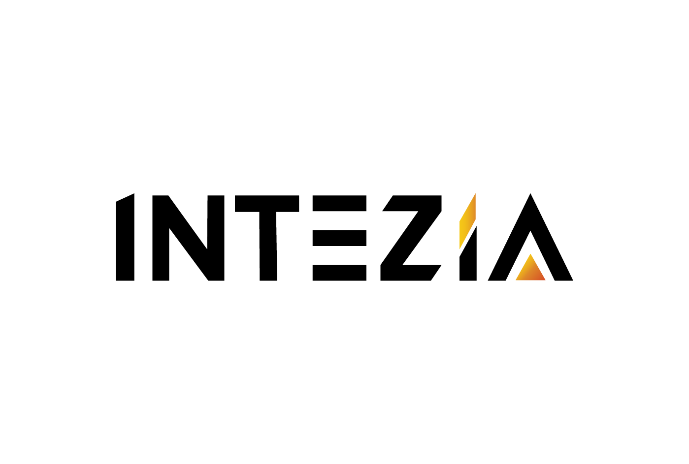

# Mapa de Calor — Slide nueva CAP-021 Implementation Plan

> **For agentic workers:** REQUIRED SUB-SKILL: Use superpowers:subagent-driven-development (recommended) or superpowers:executing-plans to implement this plan task-by-task. Steps use checkbox (`- [ ]`) syntax for tracking.

**Goal:** Insertar la slide "Mapa de Calor" entre slide 09 (Beneficios) y la actual slide 10 (Impacto) en `clientes/propuestas/pilotes-perforados/index.html`, actualizando contadores y estilos.

**Architecture:** Se añaden estilos a `styles.css` y el bloque HTML de la slide a `index.html`. No hay lógica JS. Los contadores de slides 10–13 se incrementan en 1 y el total cambia de 13 a 14 en todos los slides.

**Tech Stack:** HTML, CSS (variables ya definidas en `styles.css`), sin dependencias externas nuevas.

---

### Task 1: Agregar estilos `.s-heatmap` a `styles.css`

**Files:**
- Modify: `clientes/propuestas/pilotes-perforados/styles.css` (append al final, antes del bloque `@media print`)

- [ ] **Step 1: Localizar el bloque `@media print` en styles.css**

  Es la última sección del archivo (línea ~1762). Los nuevos estilos van justo **antes** de esa sección.

  Buscar la línea que contiene:
  ```css
  @media print {
  ```

- [ ] **Step 2: Insertar los estilos de `.s-heatmap` antes de `@media print`**

  Agregar el siguiente bloque completo:

  ```css
  /* ===========================================================================
     SLIDE 10 — Mapa de Calor (tabla enriquecida de oportunidades de automatización)
     =========================================================================== */
  .s-heatmap {
    background: var(--white);
    color: var(--black);
    padding: 50px 52px 76px 72px;
  }
  .s-heatmap::before {
    content: "";
    position: absolute;
    top: 0; left: 0;
    width: 12px; height: 100%;
    background: var(--black);
  }
  .s-heatmap .counter { color: var(--black); }
  .s-heatmap .eyebrow { color: var(--black); margin-bottom: 4px; }
  .s-heatmap h2 {
    font-family: var(--font-display);
    font-weight: 700;
    font-size: 27px;
    line-height: 1.05;
    letter-spacing: -0.02em;
    margin-bottom: 12px;
  }
  .s-heatmap h2 .hl {
    display: inline-block;
    background: var(--yellow);
    color: var(--black);
    padding: 0 10px;
  }

  /* Wrapper */
  .hm-wrap {
    flex: 1;
    display: flex;
    flex-direction: column;
    overflow: hidden;
  }

  /* Tabla principal */
  table.hm {
    width: 100%;
    border-collapse: collapse;
    table-layout: fixed;
    font-family: var(--font-body);
  }
  table.hm thead th {
    background: var(--black);
    color: var(--yellow);
    font-family: var(--font-display);
    font-weight: 700;
    font-size: 9.5px;
    letter-spacing: 0.16em;
    text-transform: uppercase;
    padding: 8px 8px;
    text-align: center;
    border: 1.5px solid #333;
  }
  table.hm thead th.th-proc { text-align: left; padding-left: 14px; }

  /* Filas separadoras de área */
  tr.area-row td {
    background: var(--black);
    color: var(--yellow);
    font-family: var(--font-display);
    font-weight: 700;
    font-size: 10px;
    letter-spacing: 0.22em;
    text-transform: uppercase;
    padding: 6px 14px;
    border: 1.5px solid #222;
  }
  tr.area-row td::before {
    content: "▸ ";
    color: var(--orange);
    font-size: 8.5px;
  }

  /* Filas de proceso */
  tr.proc-row td {
    height: 49px;
    border: 1.5px solid #ddd;
    vertical-align: middle;
    font-size: 11.5px;
    color: var(--black);
    padding: 0 8px;
  }
  td.hm-proc {
    padding-left: 14px !important;
    font-size: 11.5px;
    line-height: 1.32;
  }

  /* Columna Puntuación — 3 pills apiladas */
  td.hm-scores { text-align: center; padding: 0 6px !important; }
  .score-pills { display: flex; flex-direction: column; align-items: center; gap: 3px; }
  .pill-row    { display: flex; align-items: center; gap: 3px; }
  .pill-letter {
    font-size: 8px;
    letter-spacing: 0.04em;
    color: #777;
    width: 44px;
    text-align: right;
    flex-shrink: 0;
    font-weight: 600;
    text-transform: uppercase;
  }
  .pill {
    padding: 2px 7px;
    border-radius: 3px;
    font-size: 9px;
    font-weight: 700;
    letter-spacing: 0.04em;
    white-space: nowrap;
    min-width: 40px;
    text-align: center;
  }
  .p-alto  { background: var(--yellow);  color: var(--black); }
  .p-medio { background: #F9C980;        color: var(--black); }
  .p-bajo  { background: var(--yellow);  color: var(--black); }
  /* Para Esfuerzo y Riesgo el color se invierte: Bajo=dorado, Alto=naranja */
  .p-ef-alto, .p-ri-alto { background: var(--orange); color: var(--white); }
  .p-ef-bajo, .p-ri-bajo { background: var(--yellow); color: var(--black); }
  .p-ef-med,  .p-ri-med  { background: #F9C980;       color: var(--black); }

  /* Columna Herramienta */
  td.hm-tool { font-size: 11px; line-height: 1.3; text-align: center; }
  .tool-tag {
    display: inline-block;
    background: #f0f0f0;
    color: #333;
    font-size: 9.5px;
    font-weight: 700;
    padding: 2px 7px;
    border-radius: 3px;
    margin: 1px 2px;
    letter-spacing: 0.04em;
    border: 1px solid #ddd;
    white-space: nowrap;
  }

  /* Columna Plazo */
  td.hm-plazo { text-align: center; font-size: 11px; font-weight: 700; line-height: 1.3; }
  td.hm-plazo span { display: block; font-size: 9px; font-weight: 400; color: #888; }

  /* Columna Frecuencia */
  td.hm-frec { text-align: center; font-size: 10.5px; line-height: 1.3; }
  .frec-main { display: block; font-weight: 700; font-size: 11px; }
  .frec-sub  { display: block; font-size: 9.5px; color: #666; }

  /* Columna Prioridad */
  td.hm-pri { text-align: center; padding: 0 6px !important; }
  .hm-badge {
    display: inline-block;
    font-family: var(--font-display);
    font-weight: 700;
    font-size: 10px;
    letter-spacing: 0.1em;
    text-transform: uppercase;
    padding: 4px 9px;
    border-radius: 3px;
  }
  .hm-badge-alta  { background: var(--black); color: var(--yellow); }
  .hm-badge-media { background: var(--orange); color: var(--white); }

  /* Leyenda */
  .hm-legend {
    display: flex;
    align-items: center;
    gap: 16px;
    margin-top: 8px;
    padding-top: 7px;
    border-top: 1px solid #e0e0e0;
    flex-shrink: 0;
  }
  .hm-legend-label {
    font-size: 8.5px;
    font-weight: 700;
    letter-spacing: 0.18em;
    text-transform: uppercase;
    color: #999;
  }
  .hm-leg-item { display: flex; align-items: center; gap: 4px; font-size: 9.5px; color: #555; }
  .hm-leg-sw   { width: 12px; height: 12px; border-radius: 2px; flex-shrink: 0; }
  ```

- [ ] **Step 3: Verificar que el archivo no tenga errores de sintaxis**

  ```bash
  # Contar llaves de apertura y cierre — deben coincidir
  grep -c "{" clientes/propuestas/pilotes-perforados/styles.css
  grep -c "}" clientes/propuestas/pilotes-perforados/styles.css
  ```
  Ambos números deben ser iguales (diferencia máx de 1 por el bloque `:root`).

- [ ] **Step 4: Abrir index.html en el navegador y verificar que las slides existentes no se rompieron**

  ```bash
  open clientes/propuestas/pilotes-perforados/index.html
  ```
  Las 13 slides existentes deben verse igual que antes.

- [ ] **Step 5: Commit**

  ```bash
  git add clientes/propuestas/pilotes-perforados/styles.css
  git commit -m "feat(pilotes): estilos s-heatmap para slide Mapa de Calor"
  ```

---

### Task 2: Insertar la slide HTML entre slide 09 y slide 10

**Files:**
- Modify: `clientes/propuestas/pilotes-perforados/index.html` — insertar después del `</section>` que cierra slide 09 (línea ~433)

- [ ] **Step 1: Localizar el punto de inserción**

  Buscar la línea que contiene `<!-- 10 · Impacto`. El nuevo bloque va justo **antes** de esa línea.

- [ ] **Step 2: Insertar el bloque HTML completo de la slide**

  ```html
      <!-- 10 · Mapa de Calor — entregable principal del diagnóstico -->
      <section class="slide s-heatmap">
        <span class="counter">10 / 14</span>
        <p class="eyebrow">07 · Mapa de Calor</p>
        <h2>Dónde automatizar <span class="hl">primero</span>.</h2>

        <div class="hm-wrap">
          <table class="hm">
            <colgroup>
              <col style="width:auto">
              <col style="width:128px">
              <col style="width:158px">
              <col style="width:100px">
              <col style="width:148px">
              <col style="width:104px">
            </colgroup>
            <thead>
              <tr>
                <th class="th-proc">Proceso / Tarea</th>
                <th>Puntuación</th>
                <th>Herramienta</th>
                <th>Plazo</th>
                <th>Frecuencia / Manual</th>
                <th>Prioridad</th>
              </tr>
            </thead>
            <tbody>
              <!-- PROCURA -->
              <tr class="area-row"><td colspan="6">Procura</td></tr>
              <tr class="proc-row">
                <td class="hm-proc">Seguimiento de <strong>órdenes de compra</strong></td>
                <td class="hm-scores">
                  <div class="score-pills">
                    <div class="pill-row"><span class="pill-letter">Impacto</span><span class="pill p-alto">Alto</span></div>
                    <div class="pill-row"><span class="pill-letter">Esfuerzo</span><span class="pill p-ef-bajo">Bajo</span></div>
                    <div class="pill-row"><span class="pill-letter">Riesgo</span><span class="pill p-ri-bajo">Bajo</span></div>
                  </div>
                </td>
                <td class="hm-tool"><span class="tool-tag">Power Automate</span><span class="tool-tag">Sheets IA</span></td>
                <td class="hm-plazo">2–4 sem<span>implementación</span></td>
                <td class="hm-frec"><span class="frec-main">Diario</span><span class="frec-sub">1–2 h manuales</span></td>
                <td class="hm-pri"><span class="hm-badge hm-badge-alta">Alta</span></td>
              </tr>
              <tr class="proc-row">
                <td class="hm-proc">Solicitud de <strong>cotizaciones</strong> a proveedores</td>
                <td class="hm-scores">
                  <div class="score-pills">
                    <div class="pill-row"><span class="pill-letter">Impacto</span><span class="pill p-alto">Alto</span></div>
                    <div class="pill-row"><span class="pill-letter">Esfuerzo</span><span class="pill p-ef-bajo">Bajo</span></div>
                    <div class="pill-row"><span class="pill-letter">Riesgo</span><span class="pill p-ri-bajo">Bajo</span></div>
                  </div>
                </td>
                <td class="hm-tool"><span class="tool-tag">Gemini</span><span class="tool-tag">ChatGPT</span></td>
                <td class="hm-plazo">1–2 sem<span>implementación</span></td>
                <td class="hm-frec"><span class="frec-main">Semanal</span><span class="frec-sub">2–3 h manuales</span></td>
                <td class="hm-pri"><span class="hm-badge hm-badge-alta">Alta</span></td>
              </tr>

              <!-- CxP -->
              <tr class="area-row"><td colspan="6">Cuentas por Pagar (CxP)</td></tr>
              <tr class="proc-row">
                <td class="hm-proc"><strong>Reconciliación</strong> automática de facturas</td>
                <td class="hm-scores">
                  <div class="score-pills">
                    <div class="pill-row"><span class="pill-letter">Impacto</span><span class="pill p-alto">Alto</span></div>
                    <div class="pill-row"><span class="pill-letter">Esfuerzo</span><span class="pill p-ef-bajo">Bajo</span></div>
                    <div class="pill-row"><span class="pill-letter">Riesgo</span><span class="pill p-ri-med">Medio</span></div>
                  </div>
                </td>
                <td class="hm-tool"><span class="tool-tag">Power Automate</span><span class="tool-tag">Excel IA</span></td>
                <td class="hm-plazo">3–5 sem<span>implementación</span></td>
                <td class="hm-frec"><span class="frec-main">Mensual</span><span class="frec-sub">4–6 h manuales</span></td>
                <td class="hm-pri"><span class="hm-badge hm-badge-alta">Alta</span></td>
              </tr>
              <tr class="proc-row">
                <td class="hm-proc">Registro y <strong>categorización de pagos</strong></td>
                <td class="hm-scores">
                  <div class="score-pills">
                    <div class="pill-row"><span class="pill-letter">Impacto</span><span class="pill p-medio">Medio</span></div>
                    <div class="pill-row"><span class="pill-letter">Esfuerzo</span><span class="pill p-ef-bajo">Bajo</span></div>
                    <div class="pill-row"><span class="pill-letter">Riesgo</span><span class="pill p-ri-bajo">Bajo</span></div>
                  </div>
                </td>
                <td class="hm-tool"><span class="tool-tag">Gemini</span><span class="tool-tag">Sheets IA</span></td>
                <td class="hm-plazo">1–2 sem<span>implementación</span></td>
                <td class="hm-frec"><span class="frec-main">Diario</span><span class="frec-sub">30–45 min</span></td>
                <td class="hm-pri"><span class="hm-badge hm-badge-alta">Alta</span></td>
              </tr>

              <!-- FINANZAS -->
              <tr class="area-row"><td colspan="6">Finanzas</td></tr>
              <tr class="proc-row">
                <td class="hm-proc">Generación de <strong>reportes mensuales</strong> de cierre</td>
                <td class="hm-scores">
                  <div class="score-pills">
                    <div class="pill-row"><span class="pill-letter">Impacto</span><span class="pill p-alto">Alto</span></div>
                    <div class="pill-row"><span class="pill-letter">Esfuerzo</span><span class="pill p-ef-med">Medio</span></div>
                    <div class="pill-row"><span class="pill-letter">Riesgo</span><span class="pill p-ri-bajo">Bajo</span></div>
                  </div>
                </td>
                <td class="hm-tool"><span class="tool-tag">Gemini</span><span class="tool-tag">Power BI</span></td>
                <td class="hm-plazo">3–6 sem<span>implementación</span></td>
                <td class="hm-frec"><span class="frec-main">Mensual</span><span class="frec-sub">6–8 h manuales</span></td>
                <td class="hm-pri"><span class="hm-badge hm-badge-alta">Alta</span></td>
              </tr>
              <tr class="proc-row">
                <td class="hm-proc"><strong>Alertas</strong> de desviación presupuestal</td>
                <td class="hm-scores">
                  <div class="score-pills">
                    <div class="pill-row"><span class="pill-letter">Impacto</span><span class="pill p-medio">Medio</span></div>
                    <div class="pill-row"><span class="pill-letter">Esfuerzo</span><span class="pill p-ef-med">Medio</span></div>
                    <div class="pill-row"><span class="pill-letter">Riesgo</span><span class="pill p-ri-bajo">Bajo</span></div>
                  </div>
                </td>
                <td class="hm-tool"><span class="tool-tag">Power Automate</span><span class="tool-tag">Sheets IA</span></td>
                <td class="hm-plazo">4–8 sem<span>implementación</span></td>
                <td class="hm-frec"><span class="frec-main">Semanal</span><span class="frec-sub">1–2 h manuales</span></td>
                <td class="hm-pri"><span class="hm-badge hm-badge-media">Media</span></td>
              </tr>

              <!-- LICITACIONES -->
              <tr class="area-row"><td colspan="6">Licitaciones</td></tr>
              <tr class="proc-row">
                <td class="hm-proc">Elaboración y revisión de <strong>pliegos</strong></td>
                <td class="hm-scores">
                  <div class="score-pills">
                    <div class="pill-row"><span class="pill-letter">Impacto</span><span class="pill p-alto">Alto</span></div>
                    <div class="pill-row"><span class="pill-letter">Esfuerzo</span><span class="pill p-ef-alto">Alto</span></div>
                    <div class="pill-row"><span class="pill-letter">Riesgo</span><span class="pill p-ri-med">Medio</span></div>
                  </div>
                </td>
                <td class="hm-tool"><span class="tool-tag">Claude</span><span class="tool-tag">ChatGPT</span></td>
                <td class="hm-plazo">6–10 sem<span>implementación</span></td>
                <td class="hm-frec"><span class="frec-main">Por proyecto</span><span class="frec-sub">8–16 h manuales</span></td>
                <td class="hm-pri"><span class="hm-badge hm-badge-media">Media</span></td>
              </tr>
              <tr class="proc-row">
                <td class="hm-proc">Seguimiento de <strong>contratos activos</strong></td>
                <td class="hm-scores">
                  <div class="score-pills">
                    <div class="pill-row"><span class="pill-letter">Impacto</span><span class="pill p-medio">Medio</span></div>
                    <div class="pill-row"><span class="pill-letter">Esfuerzo</span><span class="pill p-ef-bajo">Bajo</span></div>
                    <div class="pill-row"><span class="pill-letter">Riesgo</span><span class="pill p-ri-bajo">Bajo</span></div>
                  </div>
                </td>
                <td class="hm-tool"><span class="tool-tag">Notion IA</span><span class="tool-tag">Drive IA</span></td>
                <td class="hm-plazo">2–4 sem<span>implementación</span></td>
                <td class="hm-frec"><span class="frec-main">Semanal</span><span class="frec-sub">1–2 h manuales</span></td>
                <td class="hm-pri"><span class="hm-badge hm-badge-alta">Alta</span></td>
              </tr>
            </tbody>
          </table>

          <div class="hm-legend">
            <span class="hm-legend-label">Puntuación</span>
            <div class="hm-leg-item"><div class="hm-leg-sw" style="background:#F4BA1A"></div> Favorable (alto impacto / bajo esfuerzo / bajo riesgo)</div>
            <div class="hm-leg-item"><div class="hm-leg-sw" style="background:#F9C980"></div> Nivel medio</div>
            <div class="hm-leg-item"><div class="hm-leg-sw" style="background:#E58423"></div> Requiere atención</div>
            <div class="hm-leg-item" style="margin-left:auto">
              <div class="hm-leg-sw" style="background:#000"></div>
              <span style="font-weight:700">Prioridad Alta</span>
            </div>
            <div class="hm-leg-item">
              <div class="hm-leg-sw" style="background:#E58423"></div>
              Prioridad Media
            </div>
          </div>
        </div>

        <div class="foot">
          
          <span class="meta">Pilotes Perforados · CAP-021</span>
        </div>
      </section>
  ```

- [ ] **Step 3: Abrir `index.html` en el navegador y verificar la slide 10**

  ```bash
  open clientes/propuestas/pilotes-perforados/index.html
  ```
  Confirmar: la tabla se ve completa, ninguna fila está recortada, el footer no solapa la leyenda.

- [ ] **Step 4: Commit**

  ```bash
  git add clientes/propuestas/pilotes-perforados/index.html
  git commit -m "feat(pilotes): insertar slide 10 Mapa de Calor entre Beneficios e Impacto"
  ```

---

### Task 3: Actualizar contadores de todas las slides

**Files:**
- Modify: `clientes/propuestas/pilotes-perforados/index.html`

Los contadores actuales usan el formato `XX / 13`. Con la nueva slide el total es 14 y los slides 10–13 pasan a ser 11–14.

- [ ] **Step 1: Actualizar el total de 13 → 14 en todos los contadores de slides 1–9**

  Reemplazar `/ 13` por `/ 14` en las 9 primeras slides. En `index.html`, las líneas afectadas son las que contienen `01 / 13` hasta `09 / 13`.

  Cambios exactos (buscar y reemplazar uno a uno para evitar errores):
  ```
  01 / 13  →  01 / 14
  02 / 13  →  02 / 14
  03 / 13  →  03 / 14
  04 / 13  →  04 / 14
  05 / 13  →  05 / 14
  06 / 13  →  06 / 14
  07 / 13  →  07 / 14
  08 / 13  →  08 / 14
  09 / 13  →  09 / 14
  ```

- [ ] **Step 2: Actualizar número + total en slides 10–13 (ahora 11–14)**

  ```
  10 / 13  →  11 / 14
  11 / 13  →  12 / 14
  12 / 13  →  13 / 14
  13 / 13  →  14 / 14
  ```

- [ ] **Step 3: Actualizar comentarios de sección en el HTML**

  ```
  <!-- 10 · Impacto      →  <!-- 11 · Impacto
  <!-- 11 · Propuesta    →  <!-- 12 · Propuesta
  <!-- 12 · Próximos     →  <!-- 13 · Próximos
  <!-- 13 · Cierre       →  <!-- 14 · Cierre
  ```

- [ ] **Step 4: Verificar en el navegador**

  ```bash
  open clientes/propuestas/pilotes-perforados/index.html
  ```
  Recorrer todas las slides: el contador debe ir de `01 / 14` a `14 / 14` sin saltos.

- [ ] **Step 5: Commit**

  ```bash
  git add clientes/propuestas/pilotes-perforados/index.html
  git commit -m "chore(pilotes): actualizar contadores 13→14 slides tras inserción Mapa de Calor"
  ```
